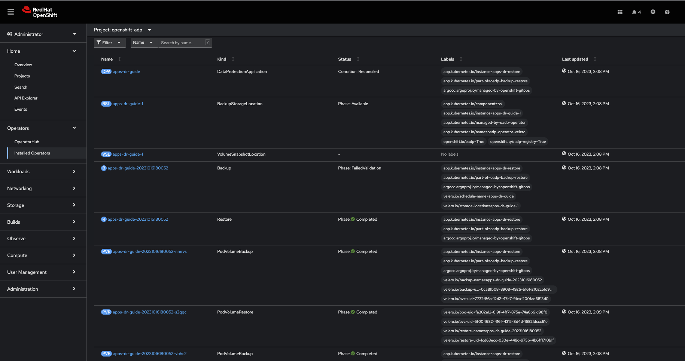

# OADP + OpenShift GitOps - An approach to implementing application disaster recovery
# Introduction

As a cluster administrator, you can back up and restore applications running on the OpenShift Container Platform by using the OpenShift API for Data Protection (OADP).

OADP backs up and restores Kubernetes resources and internal images, at the granularity of a namespace by using the version of Velero that is appropriate for the version of OADP you install, according to the table in [Downloading the Velero CLI tool](https://access.redhat.com/documentation/en-us/openshift_container_platform/4.13/html-single/backup_and_restore/#velero-obtaining-by-downloading_oadp-troubleshooting).

OADP backs up and restores persistent volumes (PVs) by using snapshots or Restic. For details, see [OADP features](https://access.redhat.com/documentation/en-us/openshift_container_platform/4.13/html-single/backup_and_restore/#oadp-features_oadp-features-plugins). In this guide, we’ll use Restic for volume backup/restore.

OADP can be leveraged to recover from any of the following situations:

-   Cross Cluster Backup/Restore

    -   You have a cluster that is in an irreparable state.

    -   You have lost the majority of your control plane hosts, leading to etcd quorum loss.

    -   Your cloud/data center region is down.

-   In-Place Cluster Backup/Restore

    -   You have deleted something critical in the cluster by mistake.

    -   You need to recover from workload data corruption within the same cluster.

The guide discusses disaster recovery in the context of implementing application backup and restore. To get a broader understanding of DR in general, read the [Additional Learning Resources](https://github.com/luqmanbarry/k8s-apps-backup-restore/tree/main#additional-learning-resources) section.

# Objective

The goal is to demonstrate a cross-cluster Backup and Restore; we backup applications in a cluster running in the AWS `us-east-2` region and then restore these apps on a cluster deployed in the AWS `eu-west-1` region. Note that we could use this guide to set up an in-place backup and restore as well; I’ll point out the setup difference when we get there.

Here’s the architecture we are going to build:

<figure>

</figure>

This guide assumes there is an up-and-running OpenShift cluster, and that the default storage solution the cluster uses implements the Container Storage Interface (CSI). Moreover, the guide supplements applications CI/CD best practices, one should opt for a fast, consistent, repeatable Continuous Deployment/Delivery process for recovering lost/deleted Kubernetes API objects.

# Prerequisites

## Cluster Storage Solution

-   You must have an S3-compatible object storage.

-   Ensure the storage solution implements the Container Storage Interface (CSI).

    -   This must be the case for source (backup from) and target (restore to) clusters.

-   Storage solution supports `StorageClass` and `VolumeSnapshotClass` API objects.

-   `StorageClass` is configured as **Default** and it is the only one with this status.

    -   Annotate it with: `storageclass.kubernetes.io/is-default-class: 'true'`

-   `VolumeSnapshotClass` is configured as **Default** and it is the only one with this status.

    -   Annotate: `snapshot.storage.kubernetes.io/is-default-class: 'true'`

    -   Label: `velero.io/csi-volumesnapshot-class: 'true'`

## Bastion (CI/CD) Host

-   Linux Packages: `yq, jq, python3, python3-pip, nfs-utils, openshift-cli, aws-cli`

-   Configure your bash_profile (`~/.bashrc`): 
    ```sh 
    alias velero='oc -n openshift-adp exec deployment/velero -c velero -it — ./velero'
    ```

-   Permission to run commands with `sudo`

-   [Argo CD CLI Installed](https://argo-cd.readthedocs.io/en/stable/cli_installation/)

## OpenShift

-   You must have the `cluster-admin` role.

-   Up and Running GitOps Instance. To learn more, follow the steps described in [Installing Red Hat OpenShift GitOps](https://docs.openshift.com/gitops/1.10/installing_gitops/installing-openshift-gitops.html).

    -   OpenShift GitOps instance should be installed in an Ops (Tooling) cluster.

    -   To protect against regional failure, the Operations cluster should be running in a region different from the BACKUP cluster region.

        -   For example, if the BACKUP cluster is running in `us-east-1`, the Operations Cluster should be deployed in `us-east-2` or `us-west-1`.

-   Applications being backed up should be healthy.

# Procedure

## Setup: OpenShift GitOps

### 1. Login (CLI) to the OpenShift cluster where GitOps is or will be running

```sh 
oc login --token=SA_TOKEN --server=API_SERVER
```

### 2. Login to ArgoCD CLI

```sh
ARGO_PASS=$(oc get secret/openshift-gitops-cluster -n
openshift-gitops -o jsonpath='{.data.admin\password}' | base64 -d)

ARGO_URL=$(oc get route openshift-gitops-server -n openshift-gitops -o jsonpath='{.spec.host}{"\n"}')

argocd login --insecure --grpc-web $ARGO_URL --username admin --password $ARGO_PASS
```

### 3. Add the OADP CRs repository.

-   Generate a read-only Personal Access Token (PAT) token from your GitHub account or any other Git solution provider.

-   Using the username (ie: git), and password (PAT Token) above, register the repository to ArgoCD

```sh 
argocd repo add https://github.com/luqmanbarry/k8s-apps-backup-restore.git \ 
    --name CHANGE_ME \ 
    --username git \ 
    --password PAT_TOKEN \ 
    --upsert \
    --insecure-skip-server-verification
```

If there are no ArgoCD RBAC issues, the repository should show up in the ArgoCD web console; and the outcome should look like this:

<figure>

</figure>

If you do see **PermissionDenied** error logs related to the above command in the `openshift-gitops-server-xxxx-xxxx` pod, it is most likely related to RBAC issues; edit the `ArgoCD` custom resource to add the group/user with required resources and actions.

For example:

<figure>

</figure>

Click on [ArgoCD RBAC Configuration](https://argo-cd.readthedocs.io/en/stable/operator-manual/rbac/) to learn more.

### 4. Add the Source (BACKUP) OpenShift Cluster

Use an account (recommended to use a `ServiceAccount`) with permission to create `Projects, OperatorGroups, Subscriptions` resources.

Login to the BACKUP cluster

```sh
BACKUP_CLUSTER_SA_TOKEN=CHANGE_ME
BACKUP_CLUSTER_API_SERVER=CHANGE_ME

oc login --token=$BACKUP_CLUSTER_SA_TOKEN --server=$BACKUP_CLUSTER_API_SERVER
```

Add the BACKUP cluster to ArgoCD

```sh
BACKUP_CLUSTER_KUBE_CONTEXT=$(oc config current-context)
BACKUP_ARGO_CLUSTER_NAME="apps-dr-backup"

argocd cluster add $BACKUP_CLUSTER_KUBE_CONTEXT \ 
    --kubeconfig $HOME/.kube/config \ 
    --name $BACKUP_ARGO_CLUSTER_NAME \ 
    --yes
```

If things go as they should, the outcome should look like this:

<figure>

</figure>

## Setup: S3 Compatible Object Storage

You should use an IAM account with read/write permissions to just this one S3 bucket. For simplicity I placed the S3 credentials in the [oadp-operator](https://github.com/luqmanbarry/k8s-apps-backup-restore/tree/main/oadp-operator/configs) helm chart; however, AWS credentials should be injected at deploy time rather than being stored in Git.

Get the IAM user `AWS_ACCESS_KEY`, and `AWS_SECRET_ACCESS_KEY`, and place them in the `oadp-operator/configs/s3-credentials` file.

The file looks like below:

<figure>

</figure>

Both the [backup helm chart](https://github.com/luqmanbarry/k8s-apps-backup-restore/tree/main/backup) and [restore helm chart](https://github.com/luqmanbarry/k8s-apps-backup-restore/tree/main/restore) deploy the OADP operator defined in the [oadp-operator helm chart](https://github.com/luqmanbarry/k8s-apps-backup-restore/tree/main/oadp-operator) as a dependency.

Once the S3 credentials are set, update the [backup helm chart](https://github.com/luqmanbarry/k8s-apps-backup-restore/tree/main/backup) and [restore helm chart](https://github.com/luqmanbarry/k8s-apps-backup-restore/tree/main/restore) dependencies. You only need to do it once per S3 bucket.

```sh
cd backup 
helm dependency update 
helm lint
```

```sh
cd restore
helm dependency update
helm lint
```

If no errors show up, you are ready to proceed to the next steps.

## Deploy sample apps we’ll use for testing backup

I have prepared two OpenShift templates that will deploy 2 stateful apps (Deployment, DeploymentConfig) in the `web-app1, web-app2` namespaces.

Login to the BACKUP cluster

```sh
BACKUP_CLUSTER_SA_TOKEN=CHANGE_ME
BACKUP_CLUSTER_API_SERVER=CHANGE_ME

oc login --token=$BACKUP_CLUSTER_SA_TOKEN --server=$BACKUP_CLUSTER_API_SERVER
```

Deploy [web-app1](https://github.com/luqmanbarry/k8s-apps-backup-restore/blob/main/sample-apps/web-app1.yaml) and [web-app2](https://github.com/luqmanbarry/k8s-apps-backup-restore/blob/main/sample-apps/web-app2.yaml).

```sh
# Web App1 
oc process -f sample-apps/web-app1.yaml -o yaml | oc apply -f - 
sleep 10
oc get deployment,pod,svc,route,pvc -n web-app1
```

```sh
# Web App2
oc process -f sample-apps/web-app2.yaml -o yaml | oc apply -f -
sleep 10
oc get deploymentconfig,pod,svc,route,pvc -n web-app2 
```

Sample web-app1, and web-app2 volumes data before starting backup. Every time the pods spin up, the entry command generates about 30MB of data.

To generate more data, delete the pods a few times.

<figure>

</figure>

<figure>

</figure>

<figure>

</figure>

After the restore, along with application resources, we expect this same data to be present on the restore cluster volumes.

## Application Backup

As you can see in the node name column, the BACKUP cluster is running in the `us-east-2` region.

<figure>

</figure>

### 1. Prepare the ArgoCD `Application` used for Backup

The ArgoCD `Application` is located here: `argocd-applications/apps-dr-backup.yaml`.

Make the necessary changes, and pay special attention to `spec.source:` and `spec.destination:`

```yaml
spec: 
  project: default

source:
  repoURL: https://github.com/luqmanbarry/k8s-apps-backup-restore.git
  targetRevision: main
  path: backup

  # Destination cluster and namespace to deploy the application
  destination:
  # cluster API URL
  name: apps-dr-backup
  # name: in-cluster
  namespace: openshift-adp
```

## 2. Prepare the backup helm chart

Update the `backup/values.yaml` file to provide the following:

-   s3 bucket name

-   namespace list

-   backup schedule

For example:

```yaml
global: 
  operatorUpdateChannel: stable-1.2 # OADP Operator Subscription Channel 
  inRestoreMode: false 
  resourceNamePrefix: apps-dr-guide # OADP CR instances name prefix
  storage:
    provider: aws
    s3:
      bucket: apps-dr-guide # S3 BUCKET NAME
      dirPrefix: oadp
      region: us-east-1

backup: 
  cronSchedule: "*/30 * * * *" # Cron Schedule - For assistance, use https://crontab.guru
  excludedNamespaces: []
  includedNamespaces: 
  - web-app1
  - web-app2 
```

Commit and push your changes to the git branch specified in the ArgoCD `Application.spec.source.targetRevision:`. You could use a Pull Request (recommended) to update the branch being monitored by ArgoCD.

### 3. Create the `apps-dr-backup` ArgoCD `Application`

Log on to the OCP cluster where the GitOps instance is running.

```sh
OCP_CLUSTER_SA_TOKEN=CHANGE_ME
OCP_CLUSTER_API_SERVER=CHANGE_ME

oc login --token=$OCP_CLUSTER_SA_TOKEN --server=$OCP_CLUSTER_API_SERVER
```

Apply the ArgoCD
[argocd-applications/apps-dr-backup.yaml](https://github.com/luqmanbarry/k8s-apps-backup-restore/blob/main/argocd-applications/apps-dr-backup.yaml)
manifest.

```sh
oc apply -f argocd-applications/apps-dr-backup.yaml
```

### 4. Inspect the Argo CD UI to ensure resources are syncing

If things go as they should, the outcome should look the image below:

<figure>

</figure>

If you run into errors such as `DataProtectionApplication, Schedule CRDs not found` as shown below; install the OADP Operator, then uninstall it and delete the `openshift-adp` namespace.

<figure>

</figure>

### 4. Verify Apps Backed Up - OpenShift Backup Cluster

<figure>

</figure>

<figure>

</figure>

### 5. Verify Apps Backed Up - S3

After a successful backup, resources will be saved in S3. For example, the backup directory content will look like the below:

<figure>

</figure>

Follow the [Troubleshooting guide](https://github.com/luqmanbarry/k8s-apps-backup-restore/tree/main#troubleshooting-guide) at the bottom of the page if the **OAD Operator  Backup** status changes to `Failed` or `PartiallyFailed`.

## Applications Restore

As you can see in the node name column, the RESTORE cluster is running in the `eu-west-1` region.

<figure>

</figure>

If the RESTORE cluster is the same as the BACKUP cluster, skip steps **#1, #2, #3, #4**, and start from [step #5](https://github.com/luqmanbarry/k8s-apps-backup-restore/tree/main#5-prepare-the-restore-helm-chart).

### 1. Setup: [Install the "OpenShift GitOps"](https://docs.openshift.com/gitops/1.10/installing_gitops/installing-openshift-gitops.html) Operator

### 2. Setup: Add the OADP CRs repository.

Login to the RESTORE cluster

```sh
RESTORE_CLUSTER_SA_TOKEN=CHANGE_ME
RESTORE_CLUSTER_API_SERVER=CHANGE_ME

oc login --token=$RESTORE_CLUSTER_SA_TOKEN --server=$RESTORE_CLUSTER_API_SERVER 
```

Login to the ArgoCD CLI

```sh
ARGO_PASS=$(oc get secret/openshift-gitops-cluster -n
openshift-gitops -o jsonpath='{.data.admin\password}' | base64 -d)

ARGO_URL=$(oc get route openshift-gitops-server -n openshift-gitops -o jsonpath='{.spec.host}{"\n"}')

argocd login --insecure --grpc-web $ARGO_URL --username admin --password $ARGO_PASS
```

Add the OADP configs repository

```sh
argocd repo add https://github.com/luqmanbarry/k8s-apps-backup-restore.git \ 
    --name CHANGE_ME \ 
    --username git \ 
    --password PAT_TOKEN \ 
    --upsert \
    --insecure-skip-server-verification 
```

If there are no ArgoCD RBAC issues, the repository should show up in the ArgoCD web console; and the outcome should look like this:

<figure>

</figure>

### 3. Setup: Add the Recovery OpenShift Cluster

```sh
RESTORE_CLUSTER_KUBE_CONTEXT=$(oc config current-context)
RESTORE_ARGO_CLUSTER_NAME="apps-dr-restore"

argocd cluster add $RESTORE_CLUSTER_KUBE_CONTEXT \ 
    --kubeconfig $HOME/.kube/config \ 
    --name $RESTORE_ARGO_CLUSTER_NAME \ 
    --yes
```

If things go as they should, the outcome should look like this:

<figure>

</figure>

### 4. Prepare the PodVolumeBackup resources

Login to AWS CLI

```sh
export AWS_ACCESS_KEY_ID=CHANGE_ME 
export AWS_SECRET_ACCESS_KEY=CHANGE_ME 
export AWS_SESSION_TOKEN=CHANGE_ME # Optional in some cases 
```

Verify you have successfully logged in by listing objects in the S3 bucket:

```sh 
# aws s3 ls s3://BUCKET_NAME

# For example 
aws s3 ls s3://apps-dr-guide 
```

In S3, select the backup (usually the latest) you want to restore from, find the `BACKUP_NAME-podvolumebackups.json.gz` file and copy its S3 URI.

In the example below, the backup name is `apps-dr-guide-20231016200052`.

<figure>

</figure>

Run the `scripts/prepare-pvb.sh script`; when prompted, provide the S3 URI you copied and then press enter.

```sh
cd scripts 
./prepare-pvb.sh 
```

Once the script completes, a new directory will be added in the [restore helm chart](https://github.com/luqmanbarry/k8s-apps-backup-restore/tree/main/restore).

<figure>

</figure>

### 5. Prepare the restore helm chart

Update the `restore/values.yaml` file with the backupName selected in S3.

```yaml 
isSameCluster: false # Set this flag to true if the RESTORE cluster is the same as the BACKUP cluster

global: 
  operatorUpdateChannel: stable-1.2 # OADP Operator Sub Channel
  inRestoreMode: true 
  resourceNamePrefix: apps-dr-guide # OADP CRs name prefix

backup: 
  name: "apps-dr-guide-20231016200052" # Value comes from S3 bucket 
  excludedNamespaces: [] # Leave empty unless you want to exclude certain namespaces from being restored. 
  includedNamespaces: [] # Leave empty if you want all namespaces. You may provide namespaces if you want a subset of projects.
```

Once satisfied, commit your changes and push.

```sh
git add . 
git commit -am "Initiating restore from apps-dr-guide-20231016200052" 
git push 
# Check that the repo is pristine 
git status 
```

### 6. Create the `apps-dr-restore` ArgoCD `Application`

Inspect the [argocd-applications/apps-dr-restore.yaml](https://github.com/luqmanbarry/k8s-apps-backup-restore/blob/main/argocd-applications/apps-dr-restore.yaml) manifest and ensure it is polling from the correct git branch and that the destination cluster is correct.

Log on to the OCP cluster where the GitOps instance is running; in our case, it is running on the recovery cluster.

```sh 
OCP_CLUSTER_SA_TOKEN=CHANGE_ME
OCP_CLUSTER_API_SERVER=CHANGE_ME

oc login --token=$OCP_CLUSTER_SA_TOKEN --server=$OCP_CLUSTER_API_SERVER 
```

Before applying the ArgoCD `Application` to trigger the recovery, I will simulate a DR by shutting down the BACKUP cluster.

<figure>

</figure>

After reloading the page.

<figure>

</figure>

Apply the ArgoCD [argocd-applications/apps-dr-restore.yaml](https://github.com/luqmanbarry/k8s-apps-backup-restore/blob/main/argocd-applications/apps-dr-restore.yaml) manifest.

```sh
oc apply -f argocd-applications/apps-dr-restore.yaml
```

### 7. Verify Applications Restore - ArgoCD UI

<figure>

</figure>

### 8. Verify Applications Restore - OCP Web Console

<figure>

</figure>

<figure>

</figure>

After a successful restore, resources will be saved to S3. For example, the restores directory content for backup `apps-dr-guide-20231016200052` will look like below:

<figure>

</figure>

Follow the [Troubleshooting guide](https://github.com/luqmanbarry/k8s-apps-backup-restore/tree/main#troubleshooting-guide) below if the **OAD Operator  Restore** status changes to `Failed` or `PartiallyFailed`.

### 9. Post Restore: Cleanup orphaned resources

OADP by default scales down `DeploymentConfigs` and does not clean up orphaned pods. You need to run the [dc-restic-post-restore.sh](https://github.com/luqmanbarry/k8s-apps-backup-restore/blob/main/scripts/dc-restic-post-restore.sh) to do the clean up.

Login to the RESTORE OpenShift Cluster

```sh 
oc login --token=SA_TOKEN_VALUE --server=CONTROL_PLANE_API_SERVER 
```

Run the cleanup script.

```sh 
# REPLACE THIS VALUE
BACKUP_NAME="apps-dr-guide-20231016200052"
./scripts/dc-restic-post-restore.sh $BACKUP_NAME 
```

### 10. Post Restore: Applications Validation

Test your applications to ensure they are working as before.

OADP was able to restore web-app1, web-app2, and all of their resources including volume data.

<figure>

</figure>

<figure>

</figure>

<figure>

</figure>

As shown, the pods are running in the `eu-west-1` region.

<figure>

</figure>

## Troubleshooting Guide

Set up the Velero CLI program before starting.

```sh 
alias velero='oc -n openshift-adp exec deployment/velero -c velero -it — ./velero' 
```

### Backup in `PartiallyFailed` status

Login to the BACKUP OCP Cluster

```sh 
oc login --token=SA_TOKEN_VALUE --server=BACKUP_CLUSTER_CONTROL_PLANE_API_SERVER 
```

Describe the Backup

```sh 
velero backup describe BACKUP_NAME 
```

View Backup Logs (all)

```sh 
velero backup logs BACKUP_NAME 
```

View Backup Logs (warnings)

```sh 
velero backup logs BACKUP_NAME | grep 'level=warn' 
```

View Backup Logs (errors)

```sh 
velero backup logs BACKUP_NAME | grep 'level=error' 
```

### Restore in `PartiallyFailed` status

Login to the RESTORE OCP Cluster

```sh 
oc login --token=SA_TOKEN_VALUE --server=RESTORE_CLUSTER_CONTROL_PLANE_API_SERVER 
```

Describe the Restore CR

```sh 
velero restore describe RESTORE_NAME 
```

View Restore Logs (all)

```sh 
velero restore logs RESTORE_NAME 
```

View Restore Logs (warnings)

```sh 
velero restore logs RESTORE_NAME | grep 'level=warn' 
```

View Restore Logs (errors)

```sh 
velero restore logs RESTORE_NAME | grep 'level=error' 
```

To further learn about debugging OADP/Velero, use these links:

-   [OADP Operator Debugging Guide](https://github.com/openshift/oadp-operator/blob/master/docs/TROUBLESHOOTING.md)

-   [Velero Troubleshooting Guide](https://velero.io/docs/v1.8/troubleshooting/)

# Conclusion

In this guide, we’ve demonstrated how to perform cross-cluster application backup and restore. We used OADP to back up applications running in the OpenShift v4.10 cluster deployed in `us-east-2`, simulated a disaster by shutting down the cluster, and restored the same apps and their state to the OpenShift v4.12 cluster running in `eu-west-1`.

# Additional Learning Resources

-   [Disaster recovery strategies for applications running on OpenShift](https://cloud.redhat.com/blog/disaster-recovery-strategies-for-applications-running-on-openshift)

-   [Stateful workloads and the two data center conundrum](https://cloud.redhat.com/blog/stateful-workloads-and-the-two-data-center-conundrum)

-   [Deploying OpenShift applications to multiple data centers](https://cloud.redhat.com/blog/deploying-openshift-applications-multiple-datacenters)

-   [Global load balancer approaches](https://cloud.redhat.com/blog/global-load-balancer-approaches)

-   Geographically distributed stateful workloads

    -   [Part1 - Cluster-Preparation](https://cloud.redhat.com/blog/geographically-distributed-stateful-workloads-part-one-cluster-preparation)

    -   [Part2 - CockroachDB](https://cloud.redhat.com/blog/geographically-distributed-stateful-workloads-part-two-cockroachdb)

    -   [Part3 - KeyCloak](https://cloud.redhat.com/blog/geographically-distributed-stateful-workloads-part-3-keycloak)

    -   [Part4 - Kafka](https://cloud.redhat.com/blog/geographically-distributed-stateful-workloads-part-four-kafka)

    -   [Part5 - YugabyteDB](https://cloud.redhat.com/blog/geographically-distributed-stateful-workloads-part-five-yugabytedb)
